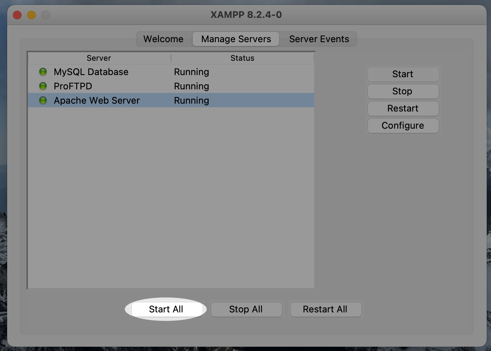
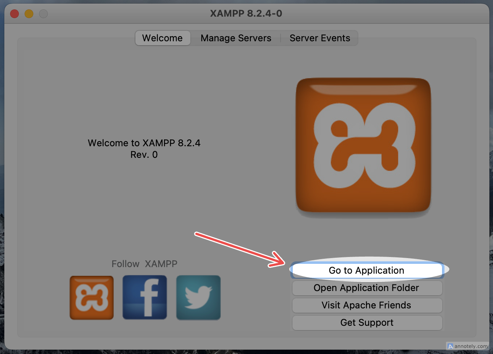
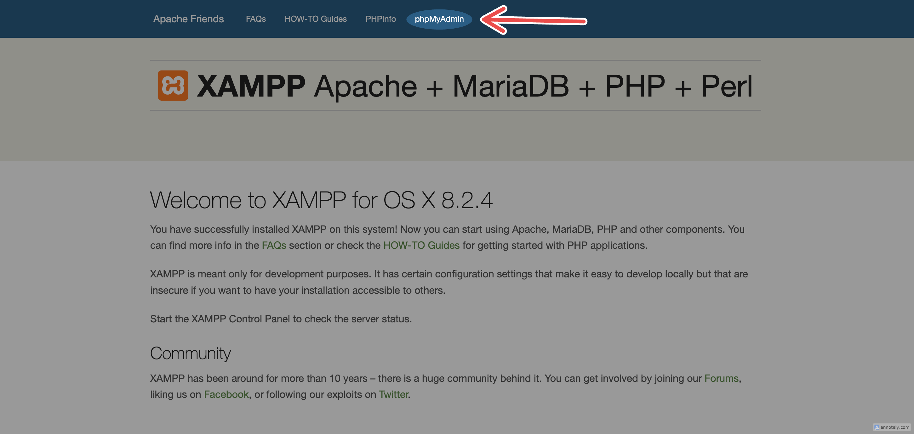
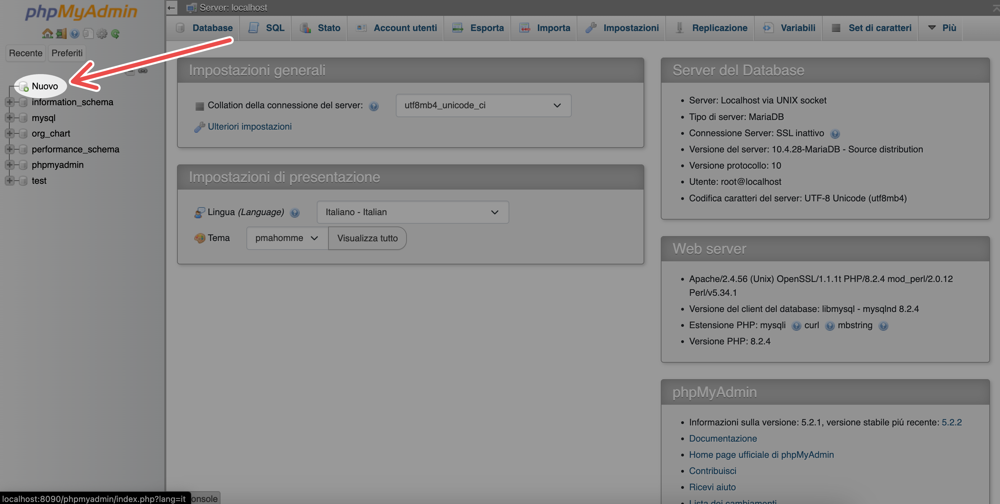
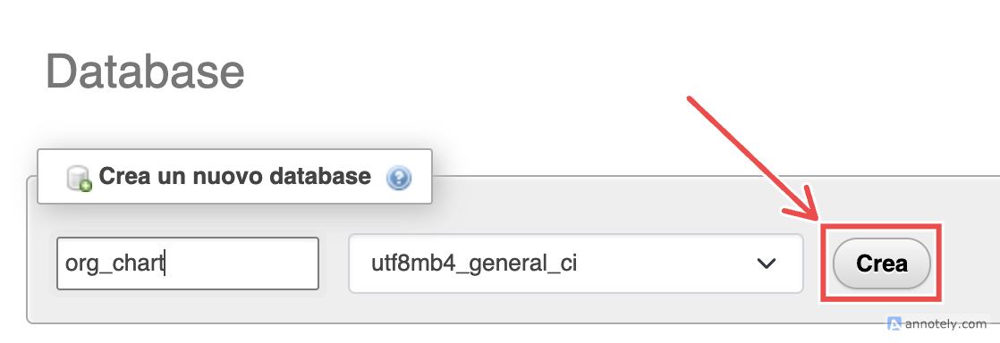
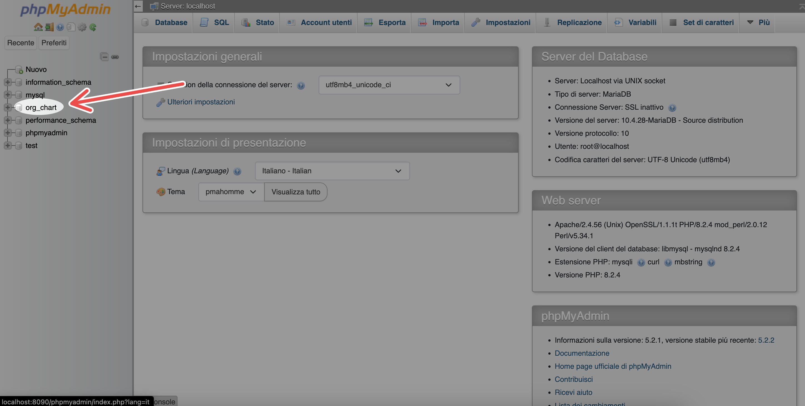
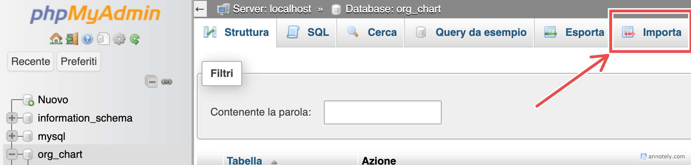
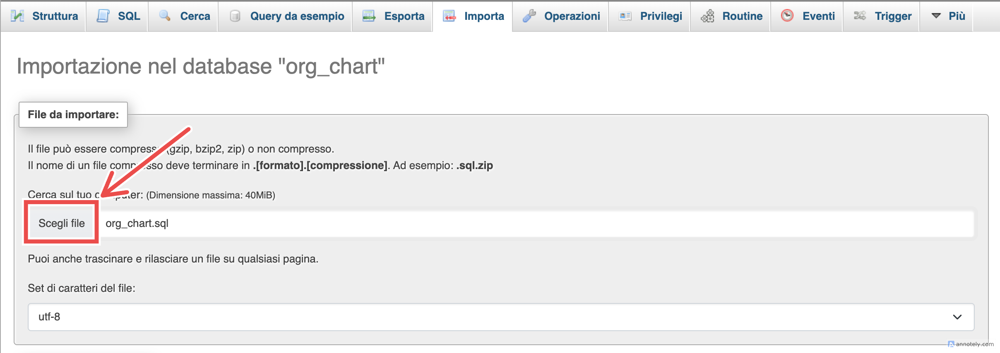

# 📁 Organigramma Aziendale

> Web application per la gestione di aziende, dipendenti e organigrammi gerarchici.

Questa applicazione consente di creare e visualizzare organigrammi dinamici per ogni azienda, con dipendenti assegnati a ruoli e reparti specifici. Il sistema è supportato da un database relazionale completo e un’architettura full-stack moderna.

---

## 🚀 Funzionalità principali

- Gestione completa di **aziende**, **dipendenti** e **ruoli** (CRUD)
- **Organigramma interattivo** per ogni azienda
- Persistenza dati tramite **Hibernate** su **database SQL**
- **REST API** per comunicazione tra frontend e backend

---

## 🛠️ Stack Tecnologico

**Backend:**  
Java · Spring Boot · Hibernate (JPA) · MySQL/MariaDB · RESTful API

**Frontend:**  
JavaScript · React.js · Node.js · npm · Material UI (MUI) · React Redux

---

## 🔗 [📊 Visualizza il Data Model](https://docs.google.com/spreadsheets/d/1xv8NQwKt-qy8W41sehuZbiq-B84vz8JdhN2cjZT-YuU/edit)


## 🗃️ Setup del Database

### 1. Scarica e installa **XAMPP**


### 2. Individua il file SQL nella struttura del progetto:

```
.
├── DB
│   └── 👉 org_chart.sql 👈
├── DataModel
│   ├── VisualParadigm
│   └── orgchart_datamodel.xlsx
├── LICENSE
├── Progettazione
│   └── Mock-Up.pdf
├── README.md
└── org_chart 
    ├── backend
    └── frontend
```

### 3. Avvia MySQL tramite **XAMPP**


### 4. Vai sull'interfaccia di configurazione online di XAMPP


### 5. Apri **phpMyAdmin**


- Crea un nuovo database chiamato `org_chart`


- Seleziona il database appena creato

- Clicca su **"Importa"**

- Seleziona il file **`org_chart.sql`** importato dal progetto

- Importa il file

✅ Il database è ora pronto all’uso.

---

## ⚙️ Come avviare il progetto

### 1. Clona il repository

```bash
git clone <URL_DEL_REPO>
```

### 2. Accedi alla cartella del progetto:

```
.
├── DB
│   └── org_chart.sql
├── DataModel
│   ├── VisualParadigm
│   └── orgchart_datamodel.xlsx
├── LICENSE
├── Progettazione
│   └── Mock-Up.pdf
├── README.md
└── 👉 org_chart 👈
    ├── backend
    └── frontend
```

### 3. Apri la cartella `org_chart` in **IntelliJ IDEA**

> ⚠️ Assicurati che IntelliJ rilevi automaticamente il file `build.gradle`.  
> In caso contrario, importa il progetto manualmente come progetto Gradle.

### 4. Clicca su **Build Project**  
<!-- [aggiungi foto esempio IntelliJ] -->

### 5. Assicurati che il database sia correttamente configurato  
Consulta la [guida al setup del database](#setup-del-database)

### 6. Avvia l’app con un solo clic:  
Seleziona la configurazione `👉 Start Backend + Frontend 👈` in alto a destra e clicca **▶️**

---

## 🌐 Accesso al frontend

- Dopo l'avvio, controlla il terminale del frontend: sarà indicato l’indirizzo (es. `http://localhost:5173`)
- ⚠️ **IMPORTANTE:** Se la porta **non è `:5173`**, potresti riscontrare problemi di comunicazione tra frontend e backend  
<!-- [aggiungi immagine del terminale] -->

---