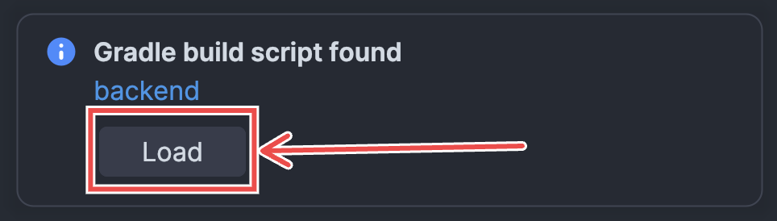
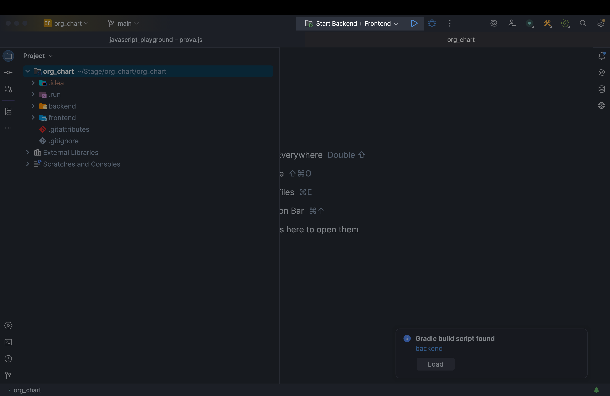
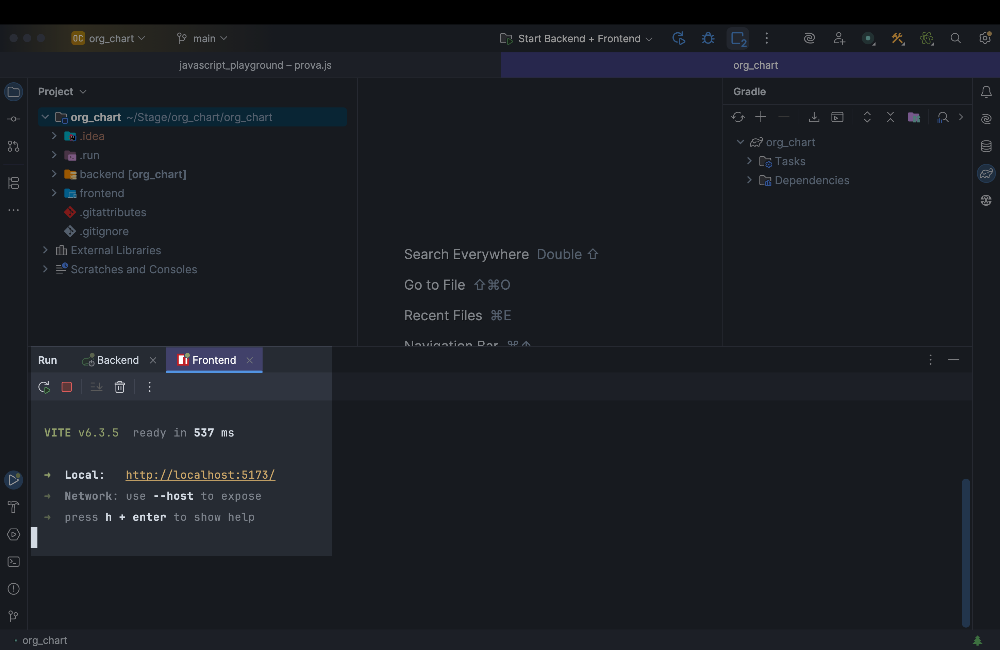
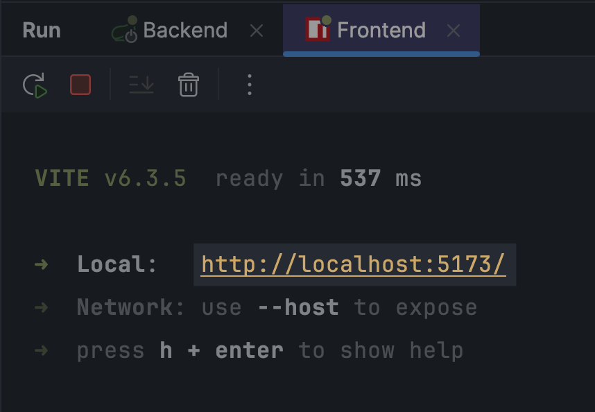

# 📁 Organigramma Aziendale

> **Web application per la gestione di aziende, dipendenti e organigrammi gerarchici**

Questa applicazione consente di creare e visualizzare organigrammi dinamici per ogni azienda, con dipendenti assegnati a ruoli e reparti specifici. Il sistema è supportato da un database relazionale completo e un'architettura full-stack moderna.

---

## 🚀 Funzionalità Principali

- **Gestione completa** di aziende, dipendenti e ruoli (CRUD)
- **Organigramma interattivo** per ogni azienda
- **Persistenza dati** tramite Hibernate su database SQL
- **REST API** per comunicazione tra frontend e backend

---

## 🛠️ Stack Tecnologico

| **Backend** | **Frontend** |
|-------------|--------------|
| Java | JavaScript |
| Spring Boot | React.js |
| Hibernate (JPA) | Node.js & npm |
| MySQL/MariaDB | Material UI (MUI) |
| RESTful API | React Redux |

---

## 📊 Data Model

🔗 **[Visualizza il Data Model completo](https://docs.google.com/spreadsheets/d/1xv8NQwKt-qy8W41sehuZbiq-B84vz8JdhN2cjZT-YuU/edit)**

---

## 🗂️ Struttura del Progetto

```
.
├── DB/
│   └── org_chart.sql                 # Script SQL del database
├── DataModel/
│   ├── VisualParadigm/
│   └── orgchart_datamodel.xlsx
├── Progettazione/
│   └── Mock-Up.pdf
├── org_chart/                        # Cartella principale
│   ├── backend/                      # Codice Spring Boot
│   └── frontend/                     # Codice React
├── LICENSE
└── README.md
```

---

## 🗓️ Setup del Database

### Passo 1: Installazione XAMPP

<div align="center">

</div>

Scarica e installa **XAMPP** per gestire il server MySQL locale.

### Passo 2: Avvio dei Servizi

Avvia MySQL tramite il pannello di controllo XAMPP:

<div align="center">

</div>

### Passo 3: Accesso all'Interfaccia Web

Vai all'interfaccia web di XAMPP:

<div align="center">

</div>

### Passo 4: Configurazione Database

1. **Apri phpMyAdmin**
   
   <div align="center">
   
   </div>

2. **Crea il database `org_chart`**
   
   <div align="center">
   
   
   </div>

3. **Seleziona il database e importa**
   
   <div align="center">
   
   
   </div>

4. **Carica il file `org_chart.sql`**
   
   <div align="center">
   
   </div>

✅ **Database configurato con successo!**

---

## ⚙️ Avvio del Progetto

### 1. Clone del Repository

```bash
git clone <URL_DEL_REPO>
```

### 2. Accedi alla cartella del progetto:

```
.
├── DB
│   └── org_chart.sql
├── DataModel
│   ├── VisualParadigm
│   └── orgchart_datamodel.xlsx
├── LICENSE
├── Progettazione
│   └── Mock-Up.pdf
├── README.md
└── 👉 org_chart 👈
    ├── backend
    └── frontend
```

### 3. Configurazione IntelliJ IDEA

- Apri la cartella `org_chart` in **IntelliJ IDEA**
- Assicurati che IntelliJ rilevi automaticamente il file `build.gradle`
- Se necessario, importa manualmente come progetto Gradle

### 3. Build del Progetto

<div align="center">

</div>

Clicca su **Load** e attendi il completamento.
<div align="center">

</div>

### 4. Installazione Dipendenze Frontend

**Solo per sistemi non-Mac:**

```bash
cd frontend
npm install
```

### 5. Avvio dell'Applicazione

<div align="center">

</div>

Seleziona la configurazione **`Start Backend + Frontend`** e clicca ▶️:

<div align="center">

</div>

#### 💻 Su altri sistemi
Dopo aver installato le dipendenze npm, usa la stessa configurazione run di IntelliJ.

---

## 🌐 Accesso all'Applicazione

Dopo l'avvio, controlla il terminale del frontend per l'URL:

<div align="center">

</div>

- **URL predefinito:** `http://localhost:5173`

<div align="center">

</div>
- ⚠️ **Importante:** Se la porta non è `:5173`, potrebbero verificarsi problemi di comunicazione tra frontend e backend

---

## 🚨 Risoluzione Problemi

| Problema | Soluzione |
|----------|-----------|
| Porta frontend diversa da `:5173` | Aggiorna la configurazione del backend |
| Database non si connette | Verifica che MySQL sia avviato in XAMPP |
| Errori di build Gradle | Controlla la versione di Java e le dipendenze |
| Dipendenze npm mancanti | Esegui `npm install` nella cartella frontend |

---

## 📝 Licenza

Questo progetto è distribuito sotto licenza [MIT](LICENSE).

---